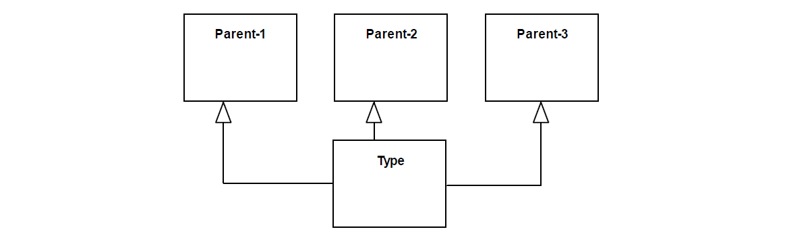

.. DecInt

DecInt anti-pattern
===================

Full name
	Deceiving Intersection
	
Type
	Logical
	
Feature
	Hierarchy
	
Description
	An occurrence of the DecInt anti-pattern occurs when a type specializes two or more concrete types.
	
Justification
	Investigate if the subtype with multiple generalizations is intentional or derived by the intersection (main) and if its extension is not empty.
	
Contraints
	1.
		The specialization of the parents into Type must be syntactically valid, e.g. if type is a relator, all its parents must also be relators.
	2.
		There must be at least two parents for which the following conditions evaluate to true:
		
		a.
			*Parent:subscript:`n`.isAbstract = false*
			
		b.
			For all *gs*: Generalization Set whose common supertype is *Parent:subscript:`n`, gs.isCovering = true*
			
Examples			
	|Examples|

Refactoring Plans
	1.
		**[conditional] [Mod] Fix Generalization Set:** can only be adopted if two or more parent types are made disjoint by a generalization set. The possible solutions are to remove the existing generalization set or set its isCovering property to true.
	2.
		**[conditional] [Mod] Fix Identity Principle:** can only be applied if Type is sortal («:ref:`Subkind`», «:ref:`Role`» or «:ref:`Phase`») and they do not follow the same identity principle. The action consists on defining the single identity provider.
	3.
		**[Mod/Del] Invert/Delete Generalization:** consists of deleting and/or inverting one or more generalizations from Type to one of the identified parents.
	4.
		**[OCL] Derived by Intersection:** create an OCL derivation or invariant constraint to specify that the extension of type is derived by the intersection of the extensions of two or more concrete parents: 
			
			| *context Parent1*
			| *inv: (self.oclIsTypeOf(Parent2) and self.oclIsTypeOf(Parent2))*
			| *implies self.oclIsTypeOf(Type)*

**References:**

Prince Sales, Tiago. (2014). Ontology Validation for Managers.			

