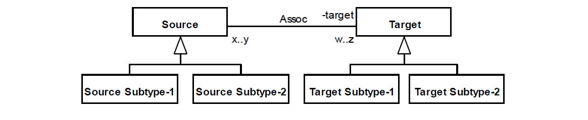

.. ImpAbs

ImpAbs anti-pattern
==================================

Full name
	Imprecise Abstraction

Type
	Logical; Scope

Feature
Association
	
Description
	A given association R characterizes an ImpAbs occurrence if at least one of the following holds: (i) R’s source end upper bound multiplicity is equal or greater than 2 and the Class connected to it has 2 or more subtypes; (ii) R’s target end upper bound multiplicity is equal or greater than 2 and the Class connected to it has 2 or more subtypes.
	
Justification
	Representing a general relation occasionally causes the model to be too permissive because one “loses control” on how many instances of a particular subtype an instance of the opposite type may be connected to. Furthermore, is precludes the specification of other particular meta-property values, like isDerived and isReadOnly for all associations, and isEssential and isInseparable for meronymics.
	
Contraints
	1.
		Let allSubtypes(c) be the function that return all direct and indirect subtypes of a class c, sourceEnd(a) and targetEnd(a) the functions that return the source and target ends of an association a, and upper(p) be the function that return the upper bound cardinality of a property p, then:
		
		.. math :: (upper(sourceEnd(Assoc)) \geq 2 \ \land \ \#allSubtypes(Source) \geq 2) \ \lor \\
			(upper(targetEnd(Assoc)) \geq 2 \land \#allSubtypes(Target) \geq 2)
						
	2.
		Let SoChildren be the set of all classes identified as Source Subtype-n, then:
		
		.. math :: \forall x \in SoChildren \ | \ x \in allSubtypes(Source)		
	
	3.
		Let TgChildren be the set of all classes identified as Target Subtype-n, then:
		
		.. math :: \forall x \in TgChildren \ | \ x \in allSubtypes(Target)
		
Examples
	|Examples|

Refactoring Plans
	1.
		**[OCL] Add multiplicity constraint:** choose this option if there is a domain restriction that requires an instance of Source, or of one of its subtypes, to be connected to a minimum, maximum or precise number of instances of Target, or one of its subtypes. The following OCL invariant enforces the desired constraint:
		
			| *context Source*
			| *inv: let sub1Size = self.target->select( x |*
			| *x.oclIsTypeOf(_'Target Subtype-1'))->size()*
			| *in sub1Size >= min1 and sub1Size <= max1*
		
	2.
		**[New] Add multiplicity constraint (subsetting association):** this option has the same logical result of the first one. However, the results are achieved through the specification of a new association (using the same stereotype of Assoc) that subsets Assoc and whose cardinalities enforce the cardinality constraints.
		
		|Refactor|
		
	3.
		**[New] Add custom meta-property (subsetting association):** choose this option if the relation between Source and Target have particular meta-properties (like isReadOnly and isEssential) when an instance of Source, or of one of its subtypes, to be connected to a minimum, maximum or precise number of instances of Target, or one of its subtypes.

**References:**

Prince Sales, Tiago. (2014). Ontology Validation for Managers.		

.. |Refactor| image:: refactor.png