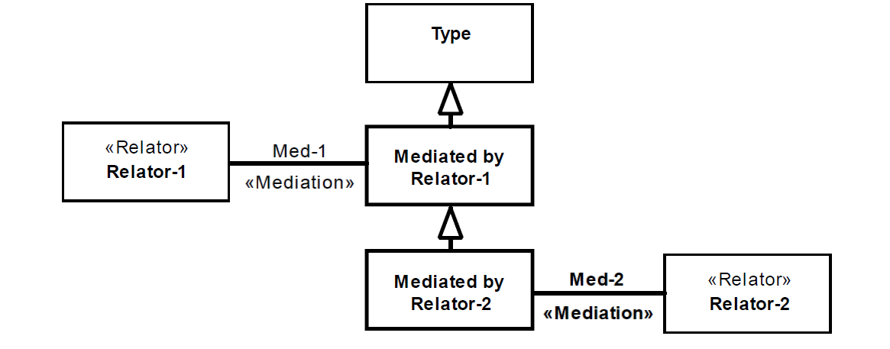

.. MultDep

MultDep anti-pattern
====================

Full name
	Multiple Relational Dependency
	
Type
	Logical; Scope
	
Feature
	Relator
	
Description
	An object class directly connected to two distinct «:ref:`relator`» types through «:ref:`mediation`» associations. The relators may not be direct or indirect specializations of one another.
		
Justification
	Externally dependent types, like all :ref:`roles<role>`, require on dependency to characterize them. Whenever more than one is provided, it can indicate redundancy, scope issues and/or modeling an extra relation between the relators that characterize the dependency.
	
Contraints
	1.
		Let R be the set of all :ref:`Relator<relator>` in a MultDep occurrence and isAncestor(c1,c2) the binary predicate that returns true if class c1 is a direct or indirect super-type of class (c2,c1):

		.. math :: \forall r1, r2 \in R, \lnot isAncestor(r1, r2) \ \land \ \lnot isAncestor(r2, r1)
	
Examples
	|Examples|

Refactoring Plans
	1.
		**[New/Mod] Unordered optional dependencies:** Create a direct subtype of Type for each dependency. (In the example below, all dependencies were set as optional for Type)
		|RefactoringPlanA|		
	2.
		**[New/Mod] Ordered optional dependencies:** Create a hierarchy line for dependencies, which an instance of Type can only acquire after others. (In the example below, all dependencies were set as optional for Type).
		|RefactoringPlanB|
	3.
		**[New] Create dependency between relators:** Create formal relations connecting relators that depend on one another. This solution generates an occurrence of AssCyc (which the user should be analyzed) and an occurrence of UndefFormal (which the user can ignore).

**References:**

Prince Sales, Tiago. (2014). Ontology Validation for Managers.
		
.. |Examples| image:: examples.png
.. |RefactoringPlanA| image:: refactoring_plan_A.png
