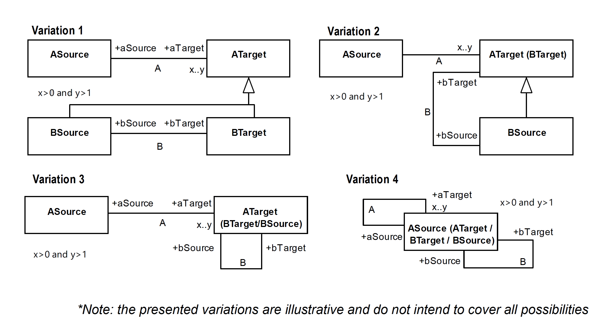

.. RelComp

RelComp anti-pattern
==================================

Full name
	Relation Composition

Type
	Logical

Feature
	Association
	
Description
	Consider two associations, no matter their stereotypes: 
		A, that connects ASource and ATarget; and
		B, that connects BSource and BTarget.
	For this anti-pattern to occur, one of the possible statements needs to be true: 
		BSource equals or is a subtype of ATarget and BTarget equals or is a subtype of ATarget. 
		BSource equals or is a subtype of ASource and BTarget equals or is a subtype of ASource.
	
Justification
	The instantiation of the two relations identified in this anti-pattern may restrict one another.
	
Contraints
	1.
		A and B are different associations.
		
	2.
		The association A must have a minimum cardinality greater than 0 and a maximum greater than 1 in the association end connected to ATarget.
	
	3.
		One of the following sentences must evaluate to true:
		
		.. math :: (ATarget = BSource \ \lor \ ancestorOf(ATarget,BSource)) \land \\
			(ATarget = BTarget \ \lor \ ancestorOf(ATarget, BTarget))
			
		.. math :: (ASource = BSource \ \lor \ ancestorOf(ASource,BSource)) \land \\
			(ASource = BTarget \ \lor \ ancestorOf(ASource, BTarget))
			
Examples
	|Examples|

Refactoring Plans
	1.
		**[OCL] Set Existential Composition:** add an OCL invariant to enforce that type B has an existential composition to type A:
		
		| *context BSource*
		| *inv: self.bTarget->asSet()->forAll( y |*
		|	*ASource.allInstances()->exists( z |*
		|		*z.aTarget->asSet()->contains(self) and*
		|		*z.aTarget->asSet()->contains(y))*
		
	2.
		**[OCL] Set Right universal Composition:** add an OCL invariant to enforce that type B has a right universal composition to type A:
		
		| *context BSource*
		| *inv: self.bTarget->asSet()->forAll( y |*
		| 	*ASource.allInstances()->forAll( z |*
		|		*z.aTarget->asSet()->contains(self) implies*
		|		*z.aTarget->asSet()->contains(y))*
		
	3.
		**[OCL] Set Left Universal Composition:** add an OCL invariant to enforce that type B has a left universal composition to type A:
		
		| *context BSource*
		| *inv: self.bTarget->asSet()->forAll( y |*
		| 	*ASource.allInstances()->forAll( z |*
		| 		*z.aTarget->asSet()->contains(y) implies*
		| 		*z.aTarget->asSet()->contains(self))*
		
	4.
		**[OCL] Set Forbidden Composition:** add an OCL invariant to enforce that type B has a forbidden composition to type A:
		
		| *context BSource*
		| *inv: self.bTarget->asSet()->forAll( y |*
		| 	*ASource.allInstances()->forAll( z |*
		|		*not(z.aTarget->asSet()->contains(y) and*
		| 		*z.aTarget->asSet()->contains(self)))*

	5.
		**[OCL] Set Custom Existential Composition:** add an OCL invariant to enforce that type B has a custom existential composition to type A:
		
		| *context BSource*
		| *inv: self.bTarget->asSet()->forAll( y |*
		| 	*ASource.allInstances()->select( z |*
		|		*z.aTarget->asSet()->contains(y) and*
		| 		*z.aTarget->asSet()->contains(self))->size()[>|<|=]n)*
	

**References:**

Prince Sales, Tiago. (2014). Ontology Validation for Managers.
		

