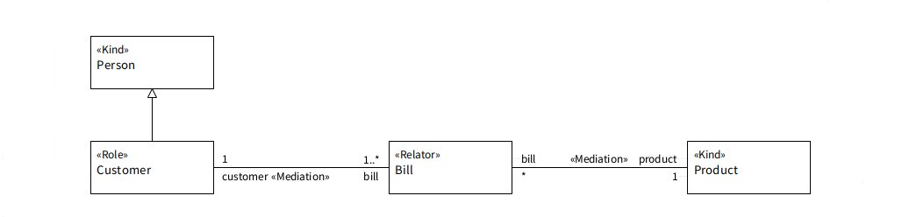

.. RepRel

RepRel anti-pattern
==================================

Full name
	Repeatable Relator Instances
	
Type
	Logical
	
Feature
	Relator
	
Description
	A «:ref:`relator`» connected to two or more «:ref:`mediation`» associations, whose upper bound cardinalities at the :ref:`relator<relator>` end are greater than one.
	
Justification
	Inspired in ORM’s uniqueness constraint (HALPIN; MORGAN, 2008), this anti-pattern aids the modeler in specifying the number of different :ref:`relators<relator>` instances that can mediated the exact same set of individuals.
	
Contraints
	1.
		Let M be the set of the mediations that characterize RepRel, relatorEnd(m) the function that return the association end whose type is the :ref:`relator<relator>` of a mediation m, and upper(p) the function that return the upper bound cardinality of a property p, then: 
		
		.. math :: \forall m \in M, upper(relatorEnd(m)) > 1
		
	2.
		Let M be the set of the mediations that characterize RepRel, relator(m) the function that returns the :ref:`relator<relator>` connected to a mediation m, then: 
		
		.. math :: \forall m \in M, relator(m) = Relator \ \lor \ isAncestor(relator(m), Relator)
		
		.. math :: \exists m \in M,  relator(m) = Relator
	
Examples			
	|Examples|

Refactoring Plans
	1.
		**[Mod]** Fix upper cardinality: this plan is individually to the mediations. It consists in changing the maximum cardinality on the :ref:`relator<relator>` to a usually lower value.
	2.
		**[OCL]** Define uniqueness constraint (Current Relator): this plan is applied to a combination of the mediations. Although it can be applied more than once, for different combinations, it cannot be applied simultaneously with the historical :ref:`relator<relator>` plan. This should be taken if there is a limit of the number of coexistent :ref:`relator<relator>` instances that mediated the same combination of the mediated types. The following OCL invariant should be created (where <n> is the limit of “cloned” :ref:`relators<relator>`):
	
			| *context Relator*
			| *inv: Relator.allInstances()->select( r | r <> self and*
			| *r.type1 = self.type1 and r.type2=self.type2)->size() = <n-1>*
	
	3.
		**[OCL]** Define uniqueness constraint (Historical Relator): this plan applies to a combination of the mediations and, although it can be applied more than once for different combinations, it cannot be applied simultaneously with the current :ref:`relator<relator>` plan.
	
			| *context Relator*
			| *inv: Relator.allInstances()->select( r | r<>self and r.type1=self.type1*
			| *and r.type2=self.type2 and concurrent(self,r))-> size()=<n-1>*
			|
			| *context Relator::concurrent(r:Relator):Boolean*
			| *body: self.start = r.start or (self.start<r.start and r.start<self.end)*
			| *or (r.start<self.start and self.start<r.end)*
		
**References:**

Prince Sales, Tiago. (2014). Ontology Validation for Managers.
	

