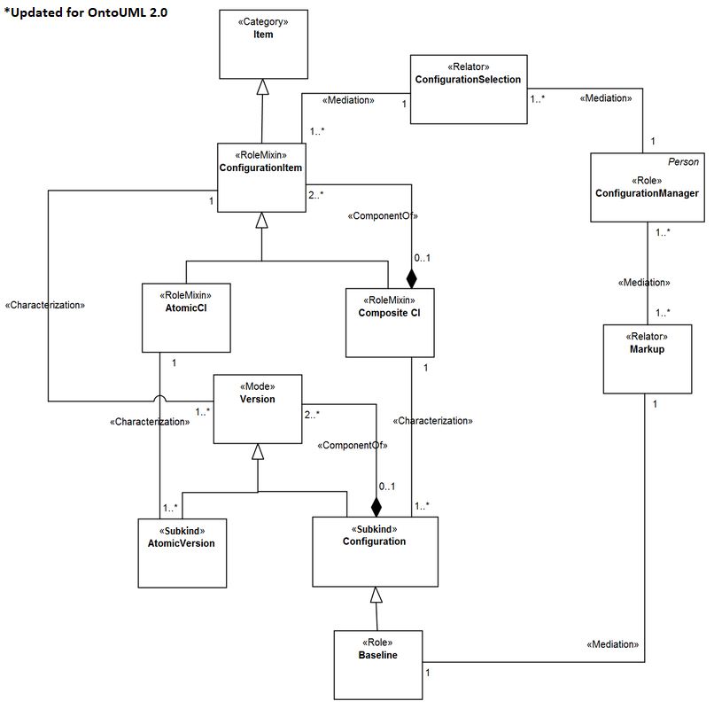

Examples
--------

**EX1:** Fragment from the Configuration Management Task Ontology (`see more <http://www.menthor.net/cmto.html>`__):

.. container:: figure

   |Example CMT|

**EX2:** Fragment from the OntoUML Org Ontology (O3) (`see more <http://www.menthor.net/o3.html>`__):

.. container:: figure

   |Example O3|

.. |Example O3| image:: _images/4611138_orig.png
