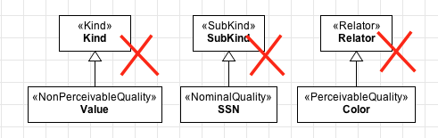
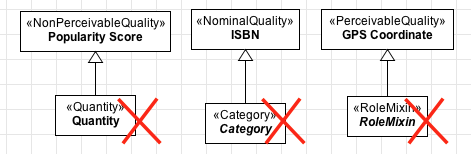

Constraints
-----------

**C1:** A «:ref:`quality`» must always be connected, through a «:ref:`characterization`» to another type.

.. container:: figure

   |Quality application 1|

**C2:** The multiplicity of the characterized end (opposite to the quality) must be exactly one. Therefore, the following examples are forbidden.

.. container:: figure

   |Quality forbidden 1|

**C3:** Qualtities cannot have as ancestors the following types: «:ref:`kind`», «:ref:`quantity`», «:ref:`collective`», «:ref:`subkind`», «:ref:`role`», «:ref:`rolemixin`», «:ref:`phase`», «:ref:`relator`», «:ref:`mode`».

.. container:: figure

   |Quality forbidden 2|

**C4:** Qualtities cannot have as descendants the following types: «:ref:`kind`», «:ref:`quantity`», «:ref:`collective`», «:ref:`rolemixin`», «:ref:`category`», «:ref:`mixin`», «:ref:`relator`», «:ref:`mode`».

.. container:: figure

   |Quality forbidden 3|

.. |Quality application 1| image:: _images/ontouml_quality-application-1.png
.. |Quality forbidden 1| image:: _images/ontouml_quality-forbidden-1.png

