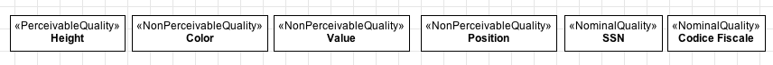
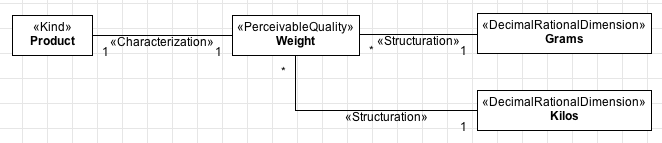

Definition
----------

A **«Quality»** is a particular type of intrinsic property which has a
structured value. Qualities are things that are existentially dependent
on the things they characterize, called their bearers. Types stereotyped
as «Quality» are also **rigid**. OntoUML differentiates between three
types of qualities:

-  **Perceivable**, which capture qualities that could be measured by an
   agent with the appropriate instrument, like weight, height, color and
   speed.
-  **Non-Perceivable**, which represent properties which cannot be
   directly measured by an instrument, like currency.
-  **Nominal**, which are used to make reference to an individual, like
   one's name, a book's ISBN or a credit card number.

Notice some examples of qualities in the next figure:

.. container:: figure

   |Quality examples|

You can define different types of geometrical structures for a quality
value using dimensions and domains. Here is an example:

.. container:: figure

   |Quality application 2|

