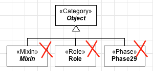

Constraints
-----------

**C1:** A «Category» is always abstract. Notice that abstract classes
are represented with an *italic* label.

.. container:: figure

   |Category application 1|

**C2:** A «Category» aggregate individuals that follow different
identity principles, therefore it may not have as ancestor the following
constructs: «Kind», «Quantity», «Collective», «Subkind», «Role»,
«Phase», «Relator», «Mode», «Quality».

.. container:: figure

   |Category forbidden 1|

**C3:** A «Category» is a rigid construct, therefore it cannot have as
ancestor an anti-rigid type, as: «Role», «RoleMixin», «Phase».

.. container:: figure

   |Category forbidden 2|

**C4:** Categories cannot have as descendants the following types:
«Mixin», «Role», «Phase».

.. container:: figure

   |Category forbidden 3|

.. |Category application 1| image:: _images/ontouml_category-application-1.png
.. |Category forbidden 1| image:: _images/ontouml_category-forbidden-1.png
.. |Category forbidden 2| image:: _images/ontouml_category-forbidden-3.png

