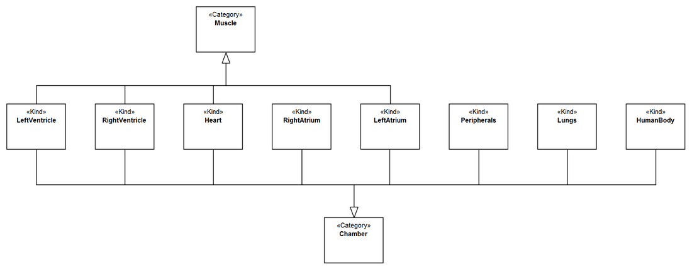
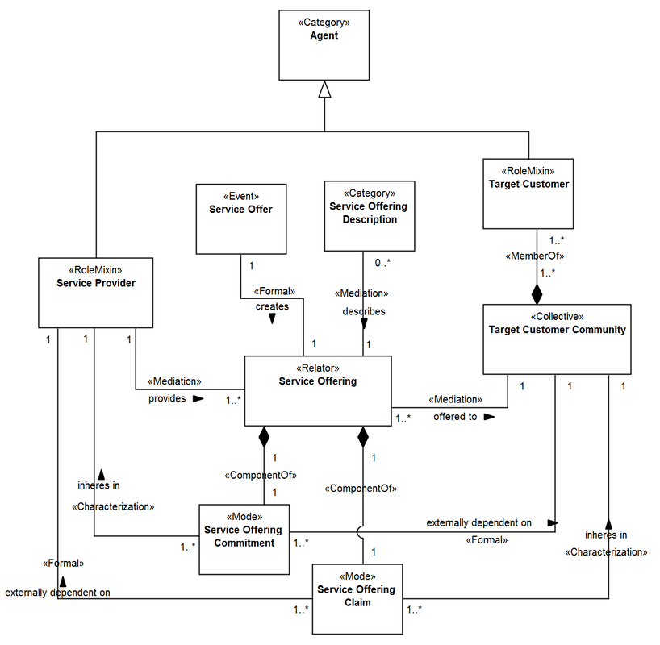

Examples
--------

**EX1:** Fragment from the ECG Ontology (`see
more <http://www.menthor.net/ecg.html>`__):

.. container:: figure

   |Example ECG|

**EX2:** Fragment from UFO-S, a commitment-based service ontology (`see
more <http://www.menthor.net/ufo-s.html>`__):

.. container:: figure

   |Example UFO-S|

