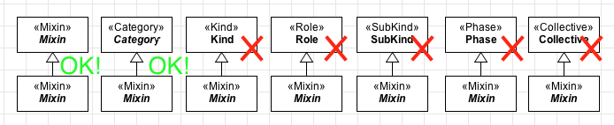

Constraints
-----------

**C1:** A «:ref:`mixin`» is always abstract. Note that abstract classes are
represented with *italic* labels.

.. container:: figure

   |Mixin application 2|

**C2:** A «:ref:`mixin`» is a :ref:`semi-rigid <rigidity>` construct and because of that, it
cannot have as ancestor either a :ref:`rigid <rigidity>` or an :ref:`anti-rigid <rigidity>` type. Therefore, only mixins can be ancestor of other mixins.

.. container:: figure

   |Mixin forbidden 1|

.. |Mixin application 2| image:: _images/ontouml_mixin-application-2.png

