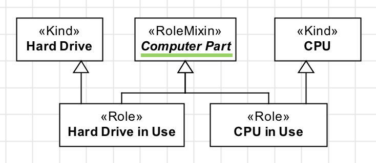
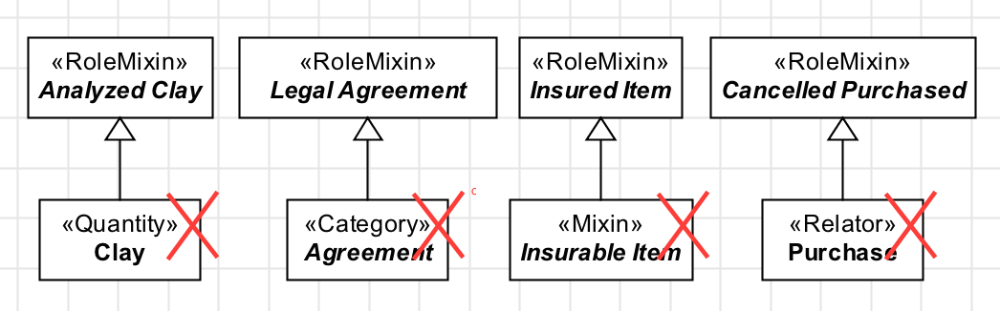

Constraints
-----------

**C1:** A «:ref:`rolemixin`» is always abstract. Notice that abstract classes
are represented with an *italic* label.

.. container:: figure

   |RoleMixin application 3|

**C2:** A «:ref:`rolemixin`» aggregate individuals that follow :ref:`different identity principles <identity>`, therefore it may not have as ancestor the following constructs: «:ref:`kind`», «:ref:`quantity`», «:ref:`collective`», «:ref:`subkind`», «:ref:`role`», «:ref:`phase`», «:ref:`relator`», «:ref:`mode`», «:ref:`quality`».

**C3:** A «:ref:`rolemixin`» is a :ref:`anti-rigid <rigidity>` construct, therefore it cannot have as descendent any :ref:`rigid <rigidity>` or :ref:`semi-rigid <rigidity>` type, as: «:ref:`Kind`», «:ref:`Quantity`», «:ref:`Collective`», «:ref:`Subkind`», «:ref:`Category`», «:ref:`Mixin`», «:ref:`Relator`», «:ref:`Mode`», «:ref:`Quality`».

.. container:: figure

   |RoleMixin forbidden 1|

