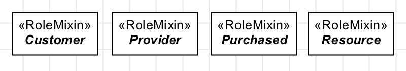
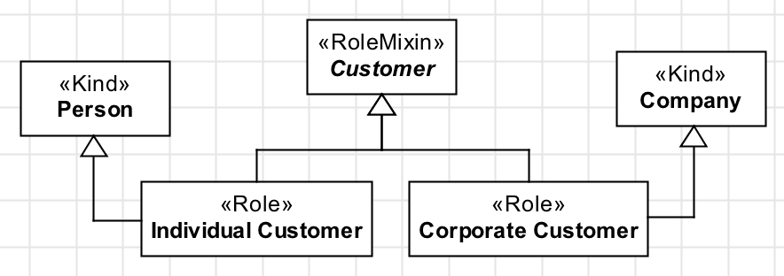
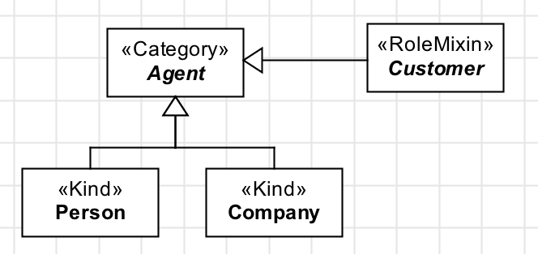

Definition
----------

A **«RoleMixin»** is the equivalent of «Role» for types that aggregate
instances with **different identity principles**. A class stereotyped as
«RoleMixin» is also an **anti-rigid** type whose instantiation depends
on a **relational** property. Here are some examples:

.. container:: figure

   |RoleMixin examples|

RoleMixins usually occur in one of the two patterns: **Pattern 1:**
RoleMixin defined by roles

.. container:: figure

   |RoleMixin application 1|

**Pattern 2:** RoleMixin as a role of a Category

.. container:: figure

   |RoleMixin application 2|

The second pattern is a more concise form of the first. They are
semantically equivalent.

