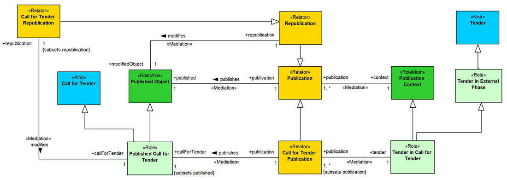

Examples
--------

.. _rolemixin-examples-ex1:
**EX1:** Fragment of the OntoUML Org Ontology (O3) (`see more <http://www.menthor.net/o3.html>`__):

.. container:: figure

   |Example O3|

.. _rolemixin-examples-ex2:
**EX2:** Fragment of a conceptual model about Brazilian Public Tenders (`see more <http://www.menthor.net/public-tenders.html>`__):

.. container:: figure

   |Example BPT|

.. |Example O3| image:: _images/8432288_orig.png

