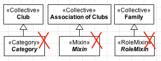

Constraints
-----------

**C1:** A «Collective» cannot have an identity provider («Kind»,
«Collective», «Quantity», «Relator», «Mode» and «Quantity») as its
direct or indirect super-type.

.. container:: figure

   |Collective forbidden 1|

**C2:** A «Collective» cannot have types that inherit identity
(«Subkind», «Role» and «Phase») as its direct or indirect super-types.

.. container:: figure

   |Collective forbidden 2|

**C3:** A «Collective» cannot have types that aggregate individuals with
different identity principles («Category», «RoleMixin» and «Mixin») as
its direct or indirect subtypes.

.. container:: figure

   |Collective forbidden 3|

**C4:** As a rigid type, a «Collective» cannot have any anti-rigid type
(«Role», «RoleMixin» and «Phase») as its direct or indirect super-type.

.. container:: figure

   |Collective forbidden 4|

.. |Collective forbidden 1| image:: _images/ontouml_collective-forbidden-1.png
.. |Collective forbidden 2| image:: _images/ontouml_collective-forbidden-2.png

.. |Collective forbidden 4| image:: _images/ontouml_collective-forbidden-4.png
