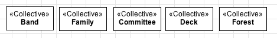

Definition
----------

The «:ref:`collective`» construct is used to represent :ref:`rigid <rigidity>` concepts
that provide an :ref:`identity principle <identity>` for their instances. The main
characteristic of a «:ref:`collective`» is that it has an homogenous internal
structure, i.e., all parts are perceived in the same way by the whole
(see the «:ref:`memberOf`» relation for more details about members of
collections).

.. container:: figure

   |Collective examples|

To decide whether or not to classify a concept as a collective, think
about the relation between it has towards its parts (or members). Do all
members are "equally perceived" by the whole (the collective)? In other
words, do all members contribute in the same way to the functionality of
the whole? If the answers are yes, you have a collective. It is
important to keep in mind that some concepts, like Family or Fleet could
be classified as both collectives and functional complexes. For
instance, if we understand a family as a group of people with equal
roles and responsibilities towards the family, we would say it is a
collective. However, if we distinguish a person as the head of the
family, and another as being responsible for the family's income, we
would say that a family is a functional complex.

.. container:: figure

   |Family|

As the other identity provider stereotypes («:ref:`kind`», «:ref:`quality`», «:ref:`relator`» and
«:ref:`mode`»), a «:ref:`collective`» can be specialized by :ref:`subkinds <subkind>`, :ref:`phases <phase>` and :ref:`roles <role>`, as well as generalized by :ref:`mixins <mixin>` and :ref:`categories <category>`.

.. container:: figure

   |Relator application 1|

.. |Family| image:: https://upload.wikimedia.org/wikipedia/commons/d/df/Family_Portrait.jpg
.. |Relator application 1| image:: _images/ontouml_relator-application-1.png
