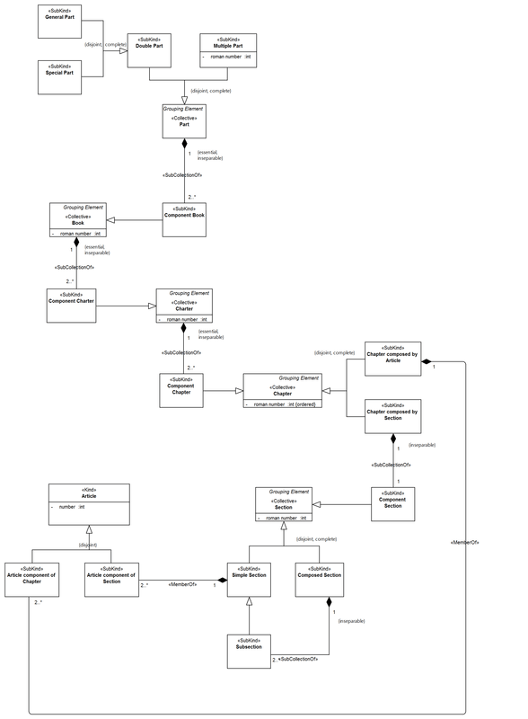

Examples
--------

.. _collective-examples-ex1:
**EX1:** Fragment from the a conceptual model about the human genome (`see more <http://www.menthor.net/cshg.html>`__):

.. container:: figure

   |Example Human Genome|

.. _collective-examples-ex2:
**EX2:** Fragment from the Normative Acts Ontology (`see more <http://www.menthor.net/normative-acts.html>`__):

.. container:: figure

   |Example NOA|

.. |Example Human Genome| image:: _images/8075130_orig.png
