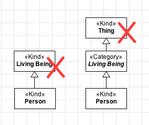
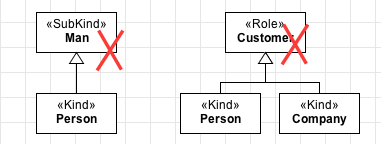

Constraints
-----------

**C1:** A «Kind» cannot have an identity provider («Kind», «Collective»,
«Quantity», «Relator», «Mode» and «Quantity») as its direct or indirect
super-type.

.. container:: figure

   |Kind forbidden 1|

**C2:** A «Kind» cannot have types that inherit identity («Subkind»,
«Role» and «Phase») as its direct or indirect super-type.

.. container:: figure

   |Kind forbidden 2|

**C3:** A «Kind» cannot have types that aggregate individuals with
different identity principles («Category», «RoleMixin» and «Mixin») as
its direct or indirect subtypes.

**C4:** As a rigid type, a «Kind» cannot have any anti-rigid type
(«Role», «RoleMixin» and «Phase») as its direct or indirect super-type.

