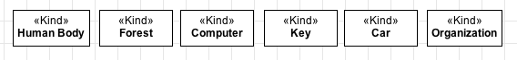

Definition
----------

A **«Kind»** is construct you are going to use in most of your models.
It is used to represent **rigid** concepts that provide an **identity
principle** for their instances and do not require a **relational
dependency**. A «Kind» represent a **Functional Complex**, i.e., a whole
that has parts contributing in different ways for its functionality (see
the ComponentOf relation for more details about functional parts). Let's
see some examples:

.. container:: figure

   |Kind examples|

