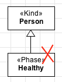
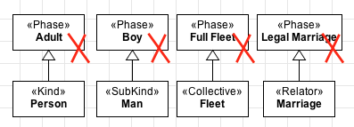

Constraints
-----------

**R1:** A «Phase» must always have **exactly one identity provider**
(«Kind», «Collective», «Quantity», «Relator», «Mode», «Quantity») as an
ancestor (a direct or indirect super-type). Our examples above should be
modelled as:

.. container:: figure

   |Phase application 1|

**R2:** A «Phase» must always be part of a partition (a generalization
set disjoint and complete). Modeling a Phase as in example below is
forbidden:

.. container:: figure

   |Phase forbidden 2|

**R3:** A «Phase» cannot be a direct subtype of a «RoleMixin» or
«Category».

.. container:: figure

   |Phase forbidden 3|

**R4:** A «Phase» cannot be a super-type of a rigid type («Kind»,
«Collective», «Quantity», «Relator», «Mode», «Quantity», «Subkind»,
«Category»).

.. container:: figure

   |Phase forbidden 1|

**R4:** A «Phase» cannot be a super-type of a mixin type («Category»,
«RoleMixin», «Mixin»).

.. container:: figure

   |Phase forbidden 4|

.. |Phase application 1| image:: _images/ontouml_phase-application-1.png

.. |Phase forbidden 3| image:: _images/ontouml_phase-forbidden-3.png

.. |Phase forbidden 4| image:: _images/ontouml_phase-forbidden-4.png
