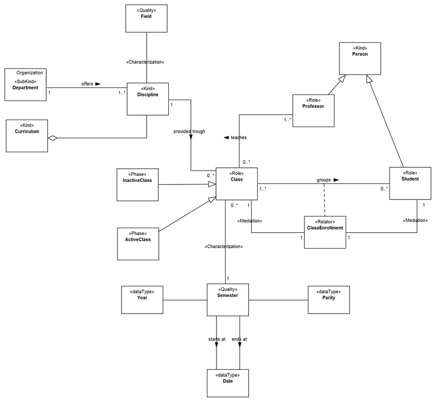

Examples
--------

.. _phase-examples-ex1:
**EX1:** Conceptual model about Brazilian Universities (`see more <http://www.menthor.net/university.html>`__):

.. container:: figure

   |Example Brazilian University|

.. container::

   **Errata:** Phase as subtype of Role (Class), no multiplicity on part-whole, not marked as material and multiplicity does not correspond with mediations, Role (Professor) has optional relation, no multiplicity on <<characterization>> relation with Field Quality, (Department gets identity from kind in different diagram), Class has no identity

