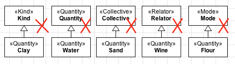

Constraints
-----------

**C1:** A «Quantity» cannot have an identity provider («Kind»,
«Collective», «Quantity», «Relator», «Mode» and «Quantity») as its
direct or indirect super-type.

.. container:: figure

   |Quantity forbidden 1|

**C2:** A «Quantity» cannot have types that inherit identity («Subkind»,
«Role» and «Phase») as its direct or indirect super-types.

.. container:: figure

   |Quantity forbidden 2|

**C3:** A «Quantity» cannot have types that aggregate individuals with
different identity principles («Category», «RoleMixin» and «Mixin») as
its direct or indirect subtypes.

.. container:: figure

   |Quantity forbidden 3|

**C4:** As a rigid type, a «Quantity» cannot have any anti-rigid type
(«Role», «RoleMixin» and «Phase») as its direct or indirect super-type.

.. container:: figure

   |Quantity forbidden 4|

.. |Quantity forbidden 2| image:: _images/ontouml_quantity-forbidden-2.png
.. |Quantity forbidden 3| image:: _images/ontouml_quantity-forbidden-4.png
.. |Quantity forbidden 4| image:: _images/ontouml_quantity-forbidden-3.png
