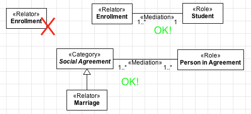

Constraints
-----------

**C1:** A «Relator» must always be connected (directly or indirectly) to
at least one relation stereotyped as «Mediation»

.. container:: figure

   |Relator forbidden 1|

**C2:** The sum of the minimum cardinalities of the opposite ends of the
mediations connected (directly or indirectly) to the relator must be
greater or equal to 2.

.. container:: figure

   |Relator application 2|

**C3:** A «Relator» cannot have an identity provider («Kind»,
«Collective», «Quantity», «Relator», «Mode» and «Quantity») as its
direct or indirect super-type.

.. container:: figure

   |Relator forbidden 2|

**C4:** A «Relator» cannot have types that inherit identity («Subkind»,
«Role» and «Phase») as its direct or indirect super-type.

.. container:: figure

   |Relator forbidden 3|

**C5:** A «Relator» cannot have types that aggregate individuals with
different identity principles («Category», «RoleMixin» and «Mixin») as
its direct or indirect subtypes.

.. container:: figure

   |Relator forbidden 5|

**C6:** As a rigid type, a «Relator» cannot have any anti-rigid type
(«Role», «RoleMixin» and «Phase») as its direct or indirect super-type.

.. container:: figure

   |Relator forbidden 4|

.. |Relator application 2| image:: _images/ontouml_relator-application-2.png
.. |Relator forbidden 2| image:: _images/ontouml_relator-forbidden-2.png
.. |Relator forbidden 3| image:: _images/ontouml_relator-forbidden-3.png
.. |Relator forbidden 5| image:: _images/ontouml_relator-forbidden-5.png
.. |Relator forbidden 4| image:: _images/ontouml_relator-forbidden-4.png
