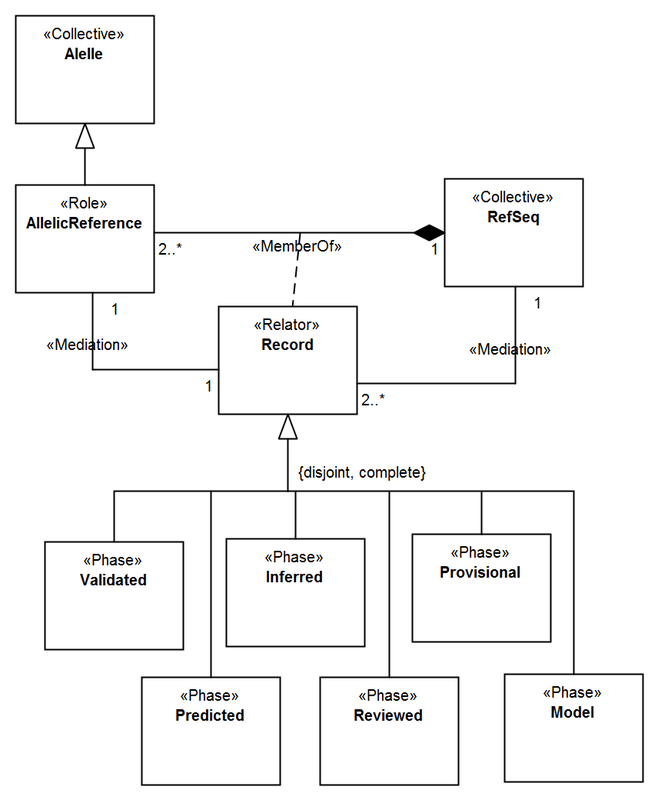

Examples
--------

**EX1:** Conceptual model about the Catholic Clergy (`see
more <http://www.menthor.net/clergy.html>`__):

.. container:: figure

   |Example Catholic Clergy|

**EX2:** Fragment of a conceptual model representing the worldview of a
possible parking lot management system (`see
more <http://www.menthor.net/parking-lot.html>`__):

.. container:: figure

   |Example Parking Lot|

**EX3:** UFO-S fragment focused on service offering (`see
more <http://www.menthor.net/ufo-s.html>`__):

.. container:: figure

   |Example UFO-S|

**EX4:** Fragment of a conceptual model about the human genome (`see
more <http://www.menthor.net/cshg.html>`__):

.. container:: figure

   |Example Human Genome|

.. |Example Catholic Clergy| image:: _images/583962_orig.png
.. |Example Parking Lot| image:: _images/parkinglot_example.png
.. |Example UFO-S| image:: _images/4586621_orig.png

