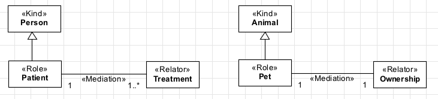
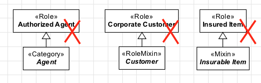

Constraints
-----------

**R1:** A «:ref:`role`» must always have **exactly one** :ref:`identity provider <identity>`
(«:ref:`kind`», «:ref:`collective`», «:ref:`quantity`», «:ref:`relator`», «:ref:`mode`», «:ref:`quantity`») as an ancestor (a direct or indirect super-type). To model our list of roles
presented above, we should given them :ref:`identity providers <identity>`:

.. container:: figure

   |Role application 1|

**R2:** Every «:ref:`role`» must be connected, directly or indirectly, to a
«:ref:`mediation`» relation, since it is a :ref:`relationally dependent <dependency>` construct.
Continuing our example above, we should do the following:

.. container:: figure

   |Role application 2|

Remember that you can't defined a :ref:`relational dependency <dependency>` with a minimum
cardinality of zero. Therefore, the fragment below is wrong!

.. container:: figure

   |Role forbidden 1|

**R3:** A «:ref:`role`» cannot be a supertype of a rigid type («:ref:`kind`»,
«:ref:`subkind`», «:ref:`collective`», «:ref:`quantity`», «:ref:`relator`», «:ref:`category`»).

.. container:: figure

   |Role forbidden 2|

**R4:** A «:ref:`role`» cannot be a supertype of a mixin types («:ref:`category`»,
«:ref:`rolemixin`», «:ref:`mixin`»).

.. container:: figure

   |Role forbidden 3|

.. |Role application 1| image:: _images/ontouml_role-application-1.png

.. |Role forbidden 1| image:: _images/ontouml_role-forbidden-1.png
.. |Role forbidden 2| image:: _images/ontouml_role-forbidden-2.png

