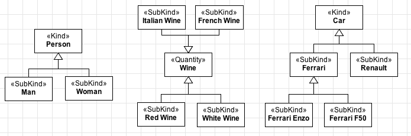

Examples
--------

**EX1:** Usually, subkinds come in groups, like in the examples below:

.. container:: figure

   |Subkind application 2|

**EX2:** Fragment from the Normative Acts Ontology (`see
more <http://www.menthor.net/normative-acts.html>`__):

.. container:: figure

   |Example NAO|

**EX3:** Fragment of a conceptual model about Brazilian Universities
(`see more <http://www.menthor.net/university.html>`__):

.. container:: figure

   |Example University|

.. |Example NAO| image:: _images/7458727_orig.png
.. |Example University| image:: _images/5083146_orig.png
