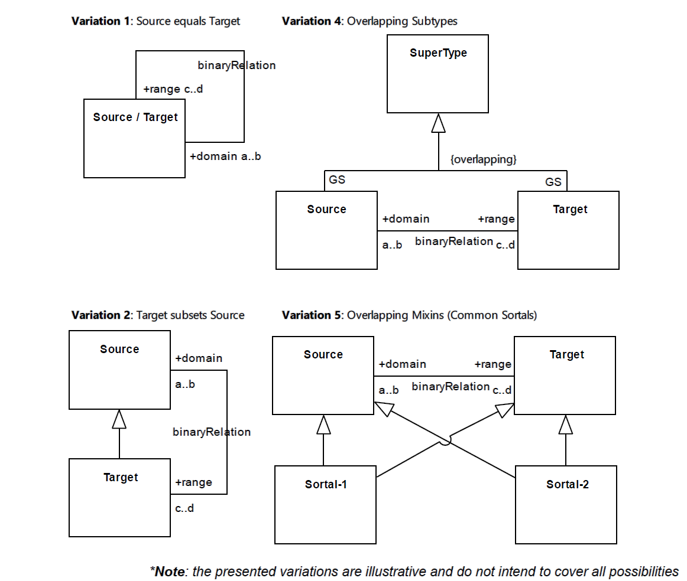

.. BinOver

BinOver anti-pattern
==================================

Full name
	Binary Relation between Overlapping Types

Type
	Logical

Feature
	Association
	
Description
	A binary relation whose end types are overlapping characterizes this anti-pattern.
	
Justification
	Modelers often do not perceive by themselves that two or more types overlap. This anti-pattern makes them aware of that and confronts modelers with the possibility to specify binary relation properties, like reflexivity, transitivity and symmetry.

Constraints
	The Binary Relation Between Overlapping Types (BinOver) corresponds to an association, of any stereotype, that connected two types that compose an overlapping set. It means that the same individual may instantiate both ends of the relationship. A given relation <R> between types *<Source>* and *<Target>* characterize a BinOver occurrence when: 

	1.
		*<Source>* equals *<Target>* 
	2. 
		*<Source>* is a direct or indirect subtype of *<Target>* 
	3. 	
		*<Target>* is a direct or indirect subtype of *<Source>* 
	4. 
		*<Source>* and *<Target>* are sortals («:ref:`subkind`», «:ref:`role`» or «:ref:`phase`») that share a common identity provider («:ref:`kind`», «:ref:`quantity`», «:ref:`collective`») and there is no generalization set which makes them explicitly disjoint
	5. 
		*<Source>* and *<Target>* are relators that share a common super-type and there is no generalization set which makes them explicitly disjoint
	6. 
		*<Source>* and *<Target>* are modes that share a common super-type and there is no generalization set which makes them explicitly disjoint; 
	7. 
		*<Source>* and *<Target>* are mixins («:ref:`category`», «:ref:`mixin`» or «:ref:`rolemixin`») that directly or indirectly generalize at least one common sortal («:ref:`kind`», «:ref:`quantity`», «:ref:`collective`», «:ref:`subkind`», «:ref:`role`», «:ref:`phase`»)
	8. 
		*<Source>* and *<Target>* are mixins («:ref:`category`», «:ref:`mixin`» or «:ref:`rolemixin`») that share a common mixin super-type and none of their subtypes are sortals

	
Examples
	|Examples|
	
Refactoring Plans
	1.
		**[Mod] Fix stereotype:** change the stereotype of the relation to fit a desired binary property
	2.
		**[OCL] Enforce binary property:** create OCL invariant to enforce a desired binary property (as long as it is compatible with the embedded constraints of the stereotype).
	3.
		**[New] Enforce disjointness:** make the related types disjoint by the specification of a disjoint generalization set.

**References:**

Prince Sales, Tiago. (2014). Ontology Validation for Managers.
		
