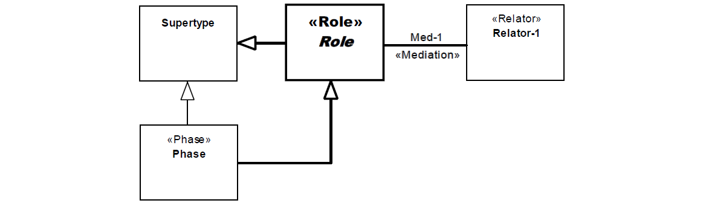

.. DepPhase

DepPhase anti-pattern
=====================

Full name
	Relationally Dependent Phase
	
Type
	Classification; Scope
	
Feature
	Phase; Relator
	
Description
	A class stereotyped as «:ref:`phase`» connected to one or more «:ref:`mediation`» associations. 
	
Justification
	:ref:`Phases<phase>` are instantiated when there is a change in an intrinsic property. :ref:`Roles<role>` are instantiated when there is a change in a relational property. Selecting the «:ref:`phase`» stereotype for a class but connecting it to a :ref:`mediation<mediation>` is “mixing up” the two meta-categories.
	
Contraints
	No additional constraints.
	
Examples
	|Examples|

Refactoring Plans
	1.
		**[New/Mod] Make the role explicit:** Create a «:ref:`role`» as a parent type of the «:ref:`phase`» and move the mediation it.
		
	|RefactoringPlans|

**References:**

Prince Sales, Tiago. (2014). Ontology Validation for Managers.
	

