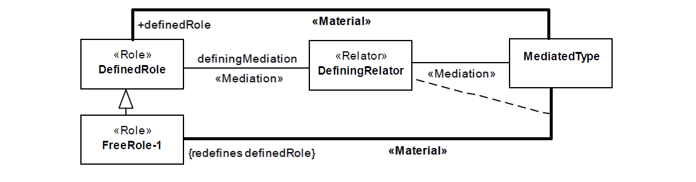

.. FreeRole

FreeRole anti-pattern
=====================

Full name
	Free Role Specialization

Type
	Logical; Scope

Feature
	Role; Relator
	
Description
	A «:ref:`role`» type connected to a «:ref:`relator`» type through a «:ref:`mediation`» association, is specialized in one or more «:ref:`role`» types, which in turn are not connected to an additional «:ref:`mediation`» association
	
Justification
	Identify the condition required for the instantiation of the subtypes of the role that are not connected to any :ref:`relator<relator>`, since no particular condition was defined.
	
Constraints
	The Free Role Specialization (FreeRole) anti-pattern occurs when a «:ref:`Role`» type connected to a «:ref:`Relator`» through a «:ref:`Mediation`» association, is specialized in other «:ref:`Role`» types, which do not directly own an additional «:ref:`Mediation`» association. Every free role must meet the following requirements:
	
	1.
		It cannot be directly connected to any :ref:`mediation<mediation>`.
	2.
		It cannot be a direct or indirect subtype of a «:ref:`RoleMixin`» that is directly connected to a :ref:`mediation<mediation>` from a hierarchy path that does not go through DefinedRole.
	
Examples
	|Examples|

Refactoring Plans
	1.
		**[OCL] Set derived role as derived:** The instantiation of a free role defined by a derivation rule, which can be defined as follows:
	
			| *context FreeRole-1 :: allInstances() : Set(FreeRole-1)*
			| *derive : DefinedRole.allInstances()->select( x | <CONDITION>)*
		
	2.
		**[New] Add independent relator:** a free role is defined by another relator which has no relation to DefiningRelator. Implies the creation of a :ref:`relator<relator>` and a :ref:`mediation<mediation>`, like in the structure:
		|RefactoringPlanA|
	3.
		**[New] Add a redefining material relation:** a free role is defined by a redefining :ref:`material relation<material>`, like in the structure:
		|RefactoringPlanB|
		
**References:**

Prince Sales, Tiago. (2014). Ontology Validation for Managers.

.. |RefactoringPlanA| image:: refactoring_plan_A.png
