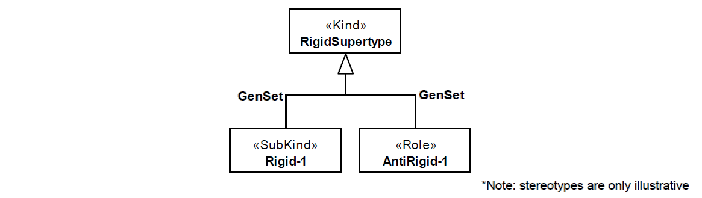

.. GSRig

GSRig anti-pattern
==================================

Full name
	Generalization Set with Mixed Rigidity

Type
	Classification; Scope

Feature
	Hierarchy; Gen. Set
	
Description
	A generalization set whose common super-type is rigid and from all its generalizations, at least one comes from an anti-rigid type and at least one comes from a rigid type.
	
Justification
	Generalization sets groups generalizations leading to a common super-type, all defined using the same specialization criterion. If the super type is not a mixin and the subtypes have different rigidity properties, they probably do not belong in the same generalization set.
	
Contraints
	No additional constrains.
	
Examples
	|Examples|

Refactoring Plans
	1.
		**[Mod] Fix subtype rigidity:** choose the option if you conclude that one or more stereotype of the subtypes is wrong. Change them to achieve only rigid or anti-rigid subtypes for the generalization set.
		
	2.
		**[New/Mod] Split generalization set:** the generalization set aggregates multiple specialization criteria. Create additional generalization sets and move the respective generalizations.
				
**References:**

Prince Sales, Tiago. (2014). Ontology Validation for Managers.
			
