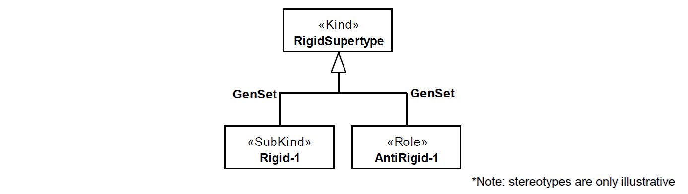

.. HetColl

HetColl anti-pattern
==================================

Full name
	Heterogeneous Collective

Type
	Classification

Feature
	Part-Whole
	
Description
	A collection type connected to two or more different member parts through «:ref:`memberOf`» relations.
	
Justification
	The multiple part types, the main characteristic of this anti-pattern, indicate that the modeler might have confused the concepts of collection and functional complex or the different relations of membership and sub-collection.
	
Contraints
	1.
		Only collections may instantiate the Whole.
	2.
		Only collections and functional complexes may instantiate all Part-n.
	3.
		Let M be the set of memberOf relations identified in an HetColl occurrence, w the class identified as the Whole, wholeType(r) the function that return the class connected to the whole end of a meronymic relation r, and ancestorSet(c) the function that returns all direct and indirect super types of a class c:
		
			.. math :: \forall m \in M, wholeType(m) = w \lor wholeType(m) \in ancestorsSet(w)
			
Examples
	|Examples|

Refactoring Plans
	1.
		**[Mod] Fix subtype rigidity:** choose the option if you conclude that one or more stereotype of the subtypes is wrong. Change them to achieve only rigid or anti-rigid subtypes for the generalization set.
	2.
		**[New/Mod] Split generalization set:** the generalization set aggregates multiple specialization criteria. Create additional generalization sets and move the respective generalizations.
	3.
		**[New/Mod] Implicit rigid subtype:** create rigid subtypes that are the new direct parents of one or more anti-rigid subtypes. If only one rigid subtype is created, the modeler can optionally set it as derived by negation of the other rigid subtypes. The following OCL template is proposed to achieve that:
	
			| *context NewRigid::allInstances() : Set(NewRigid)*
			| *derive : RigidParent.allInstances()->select( x | not(x.oclIsTypeOf(Rigid*:subscript:`1` *) or*
			| *x.oclsIsTypeOf(Rigid*:subscript:`2` *) or … or x.oclIsTypeOf(Rigid*:subscript:`n` *))*

**References:**

Prince Sales, Tiago. (2014). Ontology Validation for Managers.
			
