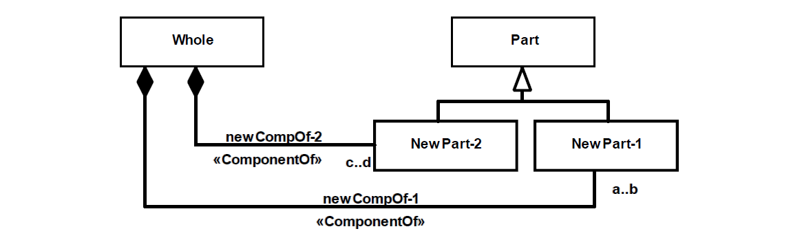

.. HomoFunc

HomoFunc anti-pattern
==================================

Full name
	Homogeneous Functional Complex

Type
	Classification; Scope

Feature
	Part-Whole
	
Description
	A functional complex type connected to a single part through a «:ref:`componentOf`» relation.
	
Justification
	If a whole is composed by a unique type of part, it is most likely that all of the part’s instances play the same role w.r.t. their whole. That homogeneous structure is not a characteristic of a functional complex.
	
Contraints
	1.
		Only functional complexes may instantiate the Whole.
		
	2.
		Only functional complexes may instantiate the Part.
	
	3.
		Whole is not indirectly connected, at the whole end, to any componentOf.
		
	4.
		partOf’s lower bound multiplicity of the part end must be greater or equal to 2.
		
Examples
	|Examples|

Refactoring Plans
	1.
		**[Mod] Set as membership:** Change the functional nature of Whole to and change the stereotype of the «:ref:`componentOf`» to «:ref:`memberOf`».
		
		|Refactor_A|
		
	2.
		**[New] Add functional parts:** Create one or more functional parts for Whole.
		
		|Refactor_B|
		
	3.
		**[New] Add part subtypes*:** Create one or more subtypes of Part and connected them to Whole through exclusive «:ref:`componentOf`» relations. The original relation might be kept, but if so, the new relations must subset, redefine or specialize it.
		 
		|Refactor_C|
		
**References:**

Prince Sales, Tiago. (2014). Ontology Validation for Managers.
		

