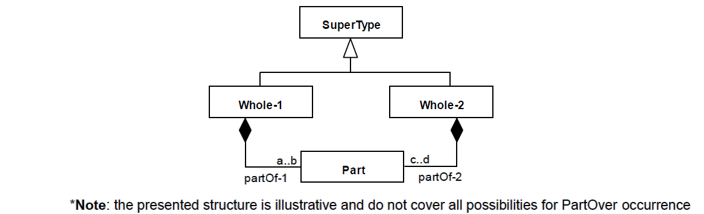
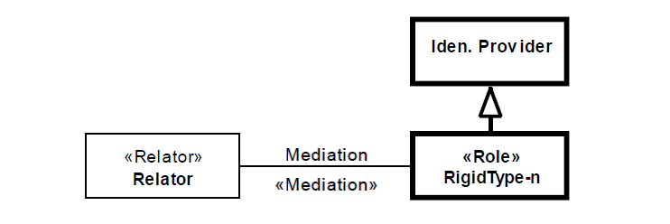
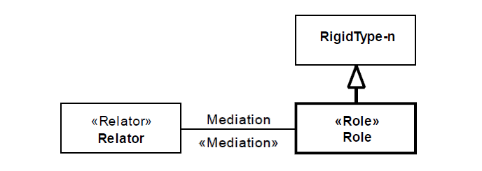

.. RelRig

RelRig anti-pattern
===================

Full name
	Relator Mediating Rigid Types
	
Type
	Logical; Scope
	
Feature
	Relator
	
Description
	A «:ref:`relator`» connected to one or more rigid types through mediations.
		
Justification
	When a type is connected to a mediation association, it means that it is externally dependent, i.e. for an individual to instantiate it, it must be related to another type. Usually, mediations define :ref:`roles<role>` and :ref:`roleMixins<roleMixin>` – anti-rigid types.
	
Contraints
	1.
		Let relator(m) and mediated(m) be the functions that return, respectively, the :ref:`relator<relator>` and the mediated types connected to a mediation. Also, let M be the set of mediation-n and R the set of RigidType-n, then: 
		
		.. math :: \forall m \in M, relator(m) = Relator \ \land \ mediated(m) \in R
 			
	2.
		Let mediatedEnd(m) be the function that returns the association end connected to the mediated type of a given mediation m, isReadOnly(p) the function that return the value of the isReadOnly meta-property of an association end p and M the set of the identified mediations, then: 
		
		.. math :: \forall m \in M, isReadOnly(mediatedEnd(m)) = true
	
Examples
	|Examples|

Refactoring Plans
	1.
		**[Mod/New] Set as role:** choose this plan when a RigidType-n should be anti-rigid. If previously stereotype with a sortal stereotype, change it to :ref:`role<role>`, if non-sortal, change to «:ref:`roleMixin`». (If RigidType-n was stereotyped as «:ref:`kind`», «:ref:`collective`» or «:ref:`quantity`», a new identity provider should be created for it using the same stereotype).
		|RefactoringPlan1|
		
	2.
		**[New/Mod] Add role subtype:** choose this action if the mediation-n is optional for RigidType-n. Create a «:ref:`role`» (for sortals) or a «:ref:`roleMixin`» (for non-sortals) that specializes RigidType-n and move mediation-n to it.
		|RefactoringPlan2|
	
	3.
		**[Mod] Set as mode:** choose this plan when RigidType-n is in fact an unstructured property of Relator-n. This is only true if the existential dependency specified in the mediation is reversed (RigidType-n should depend on «:ref:`relator`» and not the other way around)
	
	4.
		**[Mod] Set bidirectional existential dependency:** choose this action if the event that creates the :ref:`relator` is the same one that creates RigidType-n and also this relation established in the individuals creation may never change.

**References:**

Prince Sales, Tiago. (2014). Ontology Validation for Managers.
		

