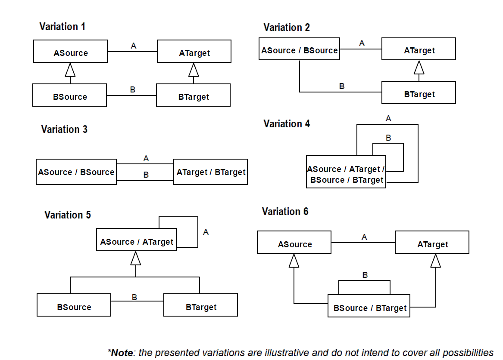

.. RelSpec

RelSpec anti-pattern
==================================

Full name
	Relation Specialization

Type
	Logical

Feature
	Association
	
Description
	Two associations A, connecting ASource to ATarget, and B, connecting BSource to BTarget, such that:
		- ASource is equal or a subtype of BSource and ATarget is equal or a subtype of BTarget; or
		- ASource is equal or a subtype of BTarget and ATarget is equal or a subtype of BSource
	
Justification
	The identified structure suggests the existence of a specialization between the relations or the need for including a subsetting, redefinition or disjoint constraint.
	
Contraints
	1.
		A and B are different associations
	2.
		One of the following sentences must evaluate to true:
		
		.. math :: (ASource = BSource \ \lor \ ancestorOf(ASource,BSource)) \land \\
			(ATarget = BTarget \ \lor \ ancestorOf(ATarget, BTarget))
		
		.. math :: (ASource = BTarget \ \lor \ ancestorOf(ASource,BTarget)) \land \\
			(ATarget = BSource \ \lor \ ancestorOf(ATarget, BSource))		
		
Examples
	|Examples|

Refactoring Plans
	1.
		**[Mod] Subset:** this action should be taken if being connected through relation B implies being connected through relation A but not the other way around. The fix consists in adding one of A’s association ends to the subsetted properties of B’s respective association end. Alternatively, the following OCL can be included in the model*:
		
			| *context BSource*
			| *inv subset : self.oclAsType(ASource).aTarget->includesAll(self.bTarget.oclAsType(ATarget)*
	2.
		**[Mod] Redefine:** this action should be taken if being related through B implies not only being related through A but requiring that all related elements through A are related through B. The fix consists in adding one of A’s association ends at the redefined properties set of B’s respective association end. Alternatively, the following OCL can be included in the model*:
		
			| *context BSource*
			| *inv subset : self.oclAsType(ASource).aTarget=self.bTarget.oclAsType(ATarget)*
		
		This solution is strongly discouraged if associations A and B related the same types.
	3.
		**[Mod/New] Disjoint:** this action should be taken if being related through B implies not being related through A. Differently from the first two, this constraint can only be enforce through OCL invariants:
	
			| *context BSource*
			| *inv subset : self.oclAsType(ASource).aTarget->excludesAll( self.bTarget.oclAsType(ATarget)*
	
	4.
		**[New] Specialize:** the logical implication of this solution is the same as enforcing subsetting. Nonetheless, it should only be selected if association B is a particular type of A and not only if the logical constraint is required.

	\*Assuming that the occurrence is the structural variation number 1.

**References:**

Prince Sales, Tiago. (2014). Ontology Validation for Managers.
	
