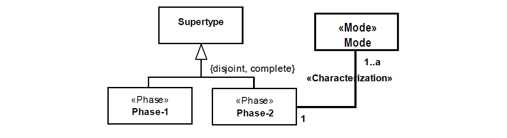

.. UndefPhase

UndefPhase anti-pattern
==================================

Full name
	Undefined Phase Partition

Type
	Classification; Scope

Feature
	Phase
	
Description
	A partition of phases in whose common parent type does own or inherit attributes and associations connected to data types or modes.
	
Justification
	Phases are anti-rigid types that are instantiated due to an alteration in an intrinsic property (a quality or a mode). For that reason, if the parent type of a partition does not have any intrinsic properties, how does one expect to define a partition?
	
Contraints
	1.
		Let qualities(c) be the function that return all qualities defined for a class c (through attributes or relations) and ancestor(c) be the function that return all direct and indirect super types of a class c, then:
		
		.. math :: \#qualities(SuperType) = 0 \ \land \ \forall x \in ancestor(SuperType), \#qualities(x) = 0
			
Examples
	|Examples|

Refactoring Plans
	1.
		**[New/OCL] Derived partition:** choose this option if the instantiation of the phases is defined by a change in a quality’s value, owned by the common parent type, one of its ancestor, one of its parts or one of its modes. (e.g. Person-Adult-Child).

		|Refactor_a|
	2.
		**[New] Intentional partition:** choose this option if the instantiation of the phases is defined by the appearance of a mode or a quality in the phases (e.g. Person-Sick-Healthy)
		
		|Refactor_b|
	3.
		**[Mod/New] Set phases as roles:** choose this option if the instantiation of the phases is defined by a relational property and not an intrinsic one. To fix, change the stereotype of all phases to role and define their respective relational dependencies.

**References:**

Prince Sales, Tiago. (2014). Ontology Validation for Managers.
		

