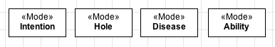

Definition
----------

A «:ref:`mode`» is a particular type of intrinsic property that has no structured value. Like :ref:`qualities <quality>`, modes are also individuals that existentially depend on their **bearers**. Types stereotyped as «:ref:`mode`» are also :ref:`rigid <rigidity>`. You can find some examples of modes below:

.. container:: figure

   |Mode examples|

