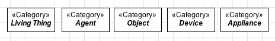

Definition
----------

A «:ref:`category`» is a :ref:`rigid <rigidity>` mixin that does not require a dependency to be specified. It is used to aggregate essential properties to individuals which following :ref:`different identity principles <identity>`. Let's see some examples:

.. container:: figure

   |Category examples|

Categories are usually used in a refactoring process. For example, let's suppose that you defined two classes in your model, Person and Animal. Now you want to state that either people and animals have a weight. You than create a «:ref:`category`», which has weight, and generalize the existing classes into it.

