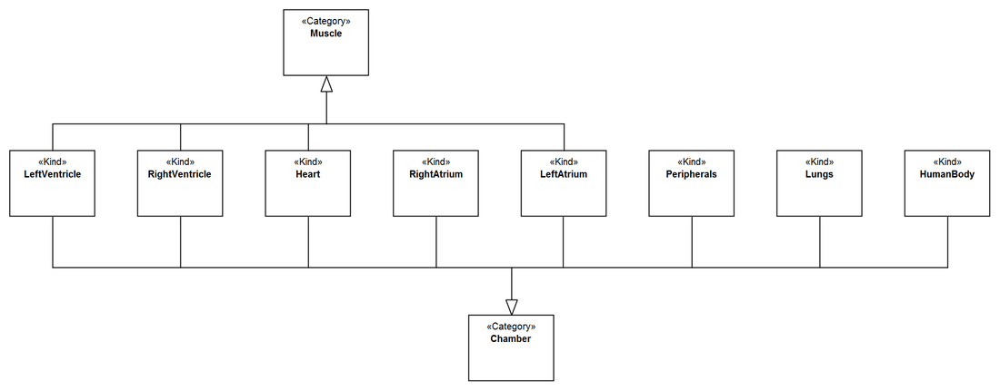
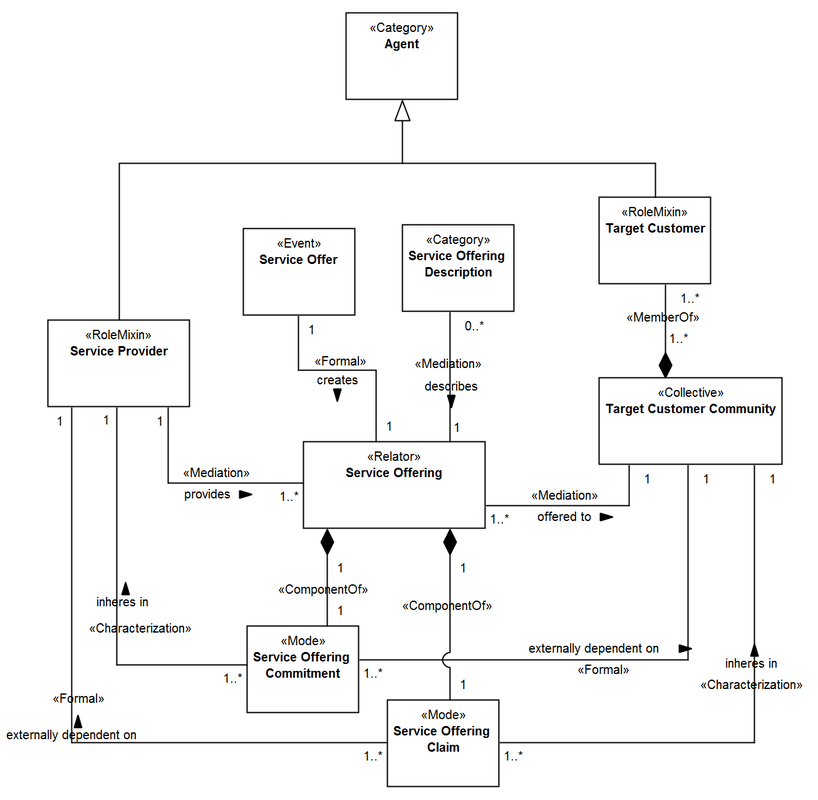

Examples
--------

.. _category-examples-ex1:

**EX1:** Fragment from the ECG Ontology (`see more <http://web.archive.org/web/20171008151934/http://www.menthor.net/ecg.html>`__):

.. container:: figure

   |Example ECG|

.. _category-examples-ex2:

**EX2:** Fragment from UFO-S, a commitment-based service ontology (`see more <http://web.archive.org/web/20171007071851/http://www.menthor.net/ufo-s.html>`__):

.. container:: figure

   |Example UFO-S|

