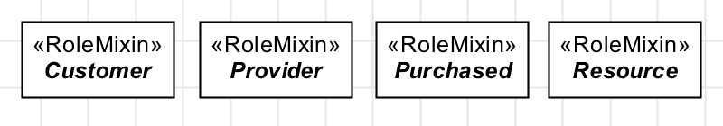
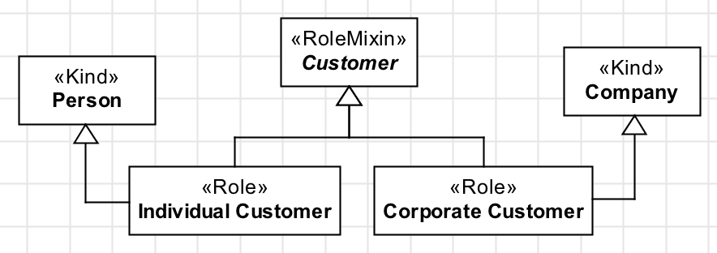
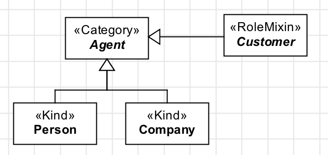

Definition
----------

A «:ref:`rolemixin`» is the equivalent of «:ref:`role`» for types that aggregate instances with :ref:`different identity principles <identity>`. A class stereotyped as «:ref:`rolemixin`» is also an :ref:`anti-rigid <rigidity>` type whose instantiation depends on a relational property. Here are some examples:

.. container:: figure

   |RoleMixin examples|

RoleMixins usually occur in one of the two patterns:

- **Pattern 1:** «:ref:`rolemixin`» defined by roles

.. container:: figure

   |RoleMixin application 1|

- **Pattern 2:** «:ref:`rolemixin`» as a role of a «:ref:`category`»

.. container:: figure

   |RoleMixin application 2|

The second pattern is a more concise form of the first. They are semantically equivalent.

