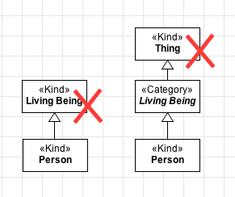
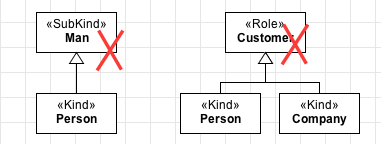

Constraints
-----------

.. _kind-constraints-c1:
**C1:** A «:ref:`kind`» cannot have an :ref:`identity <identity>` provider («:ref:`kind`», «:ref:`collective`», «:ref:`quality`», «:ref:`relator`», «:ref:`mode`» and «:ref:`quantity`») as its direct or indirect super-type.

.. container:: figure

   |Kind forbidden 1|

.. _kind-constraints-c2:
**C2:** A «:ref:`kind`» cannot have types that inherit :ref:`identity <identity>` («:ref:`subkind`», «:ref:`role`» and «:ref:`phase`») as its direct or indirect super-type.

.. container:: figure

   |Kind forbidden 2|

.. _kind-constraints-c3:
**C3:** A «:ref:`kind`» cannot have types that aggregate individuals with :ref:`different identity principles <identity>` («:ref:`category`», «:ref:`rolemixin`» and «:ref:`mixin`») as its direct or indirect subtypes.

.. _kind-constraints-c4:
**C4:** As a :ref:`rigid <rigidity>` type, a «:ref:`Kind`» cannot have any :ref:`anti-rigid <rigidity>` type («:ref:`role`», «:ref:`rolemixin`» and «:ref:`phase`») as its direct or indirect super-type.

