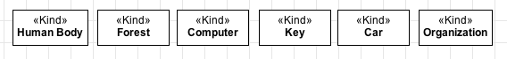

Definition
----------

A «:ref:`kind`» is construct you are going to use in most of your models. It is used to represent :ref:`rigid <rigidity>` concepts that provide an :ref:`identity principle <identity>` for their instances and do not require a :ref:`relational dependency <dependency>`. A «:ref:`kind`» represent a **Functional Complex**, i.e., a whole that has parts contributing in different ways for its functionality (see the ComponentOf relation for more details about functional parts). Let's see some examples:

.. container:: figure

   |Kind examples|

