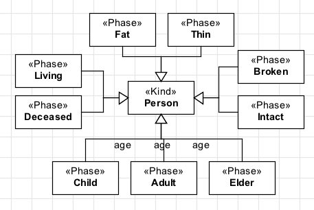
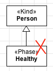
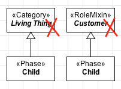
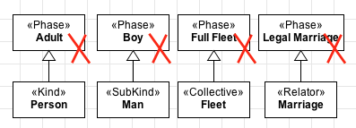
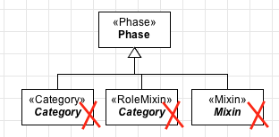

Constraints
-----------

.. _phase-constraints-c1:

**C1:** A «:ref:`phase`» must always have **exactly one identity provider** («:ref:`kind`», «:ref:`collective`», «:ref:`quantity`», «:ref:`relator`», «:ref:`mode`», «:ref:`quantity`») as an ancestor (a direct or indirect super-type). Our examples above should be modelled as:

.. container:: figure

   |Phase application 1|

.. _phase-constraints-c2:

**C2:** A «:ref:`phase`» must always be part of a partition (a generalization set disjoint and complete). Modeling a «:ref:`phase`» as in example below is forbidden:

.. container:: figure

   |Phase forbidden 2|

.. _phase-constraints-c3:

**C3:** A «:ref:`phase`» cannot be a direct subtype of a «:ref:`rolemixin`» or «:ref:`category`».

.. container:: figure

   |Phase forbidden 3|

.. _phase-constraints-c4:

**C4:** A «:ref:`phase`» cannot be a super-type of a :ref:`rigid <rigidity>` type («:ref:`kind`», «:ref:`collective`», «:ref:`quantity`», «:ref:`relator`», «:ref:`mode`», «:ref:`quantity`», «:ref:`subkind`», «:ref:`category`»).

.. container:: figure

   |Phase forbidden 1|

.. _phase-constraints-c5:

**C5:** A «:ref:`phase`» cannot be a super-type of a mixin type («:ref:`category`», «:ref:`rolemixin`», «:ref:`mixin`»).

.. container:: figure

   |Phase forbidden 4|

