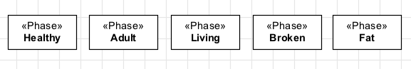

Definition
----------

The «:ref:`phase`» stereotype is used to represent :ref:`anti-rigid <rigidity>` subtypes of :ref:`identity providers <identity>` («:ref:`kind`», «:ref:`collective`», «:ref:`quantity`», «:ref:`relator`», «:ref:`mode`» and «:ref:`quantity`») that are instantiated by changes in intrinsic properties (e.g. the age of a person, the color of an object, the condition of a car). All instances of a particular «:ref:`phase`» must follow the same :ref:`identity principle <identity>`. Phases always come in :ref:`partitions <phase-partition-pattern>`.

.. note::

   *Tip*: When defining a phase :ref:`partition <phase-partition-pattern>`, think about which property (or properties) variation is causing the instantiation of the phases and include it in your model. For instance, when defining the phases Child, Adult and Elder for Person, you should include an age property for the type Person.

Here are some examples of phases:

.. container:: figure

   |Phase examples|

