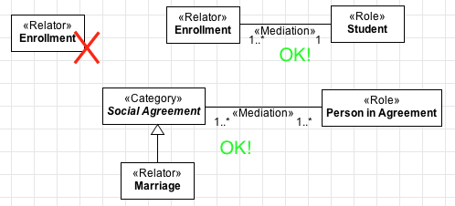
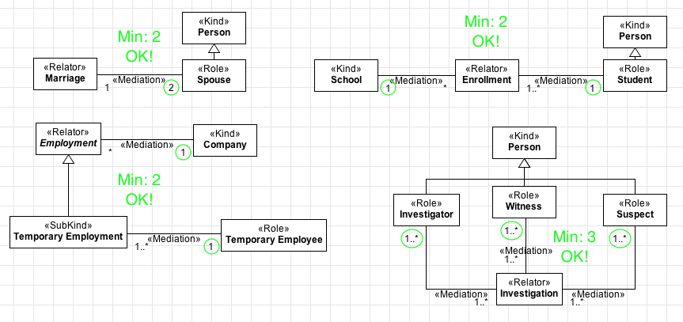
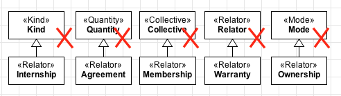
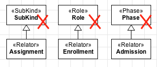
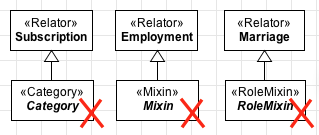
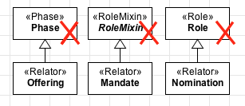

Constraints
-----------

.. _relator-constraints-c1:

**C1:** A «:ref:`relator`» must always be connected (directly or indirectly) to at least one relation stereotyped as «:ref:`mediation`»

.. container:: figure

   |Relator forbidden 1|

.. _relator-constraints-c2:

**C2:** The sum of the minimum cardinalities of the opposite ends of the :ref:`mediations <mediation>` connected (directly or indirectly) to the «:ref:`relator`» must be greater or equal to 2.

.. container:: figure

   |Relator application 2|

.. _relator-constraints-c3:

**C3:** A «:ref:`relator`» cannot have an :ref:`identity provider <identity>` («:ref:`kind`», «:ref:`collective`», «:ref:`quantity`», «:ref:`relator`», «:ref:`mode`» and «:ref:`quantity`») as its direct or indirect super-type.

.. container:: figure

   |Relator forbidden 2|

.. _relator-constraints-c4:

**C4:** A «:ref:`relator`» cannot have types that inherit :ref:`identity <identity>` («:ref:`subkind`», «:ref:`role`» and «:ref:`phase`») as its direct or indirect super-type.

.. container:: figure

   |Relator forbidden 3|

.. _relator-constraints-c5:

**C5:** A «:ref:`relator`» cannot have types that aggregate individuals with different :ref:`identity principles <identity>` («:ref:`category`», «:ref:`rolemixin`» and «:ref:`mixin`») as its direct or indirect subtypes.

.. container:: figure

   |Relator forbidden 5|

.. _relator-constraints-c6:

**C6:** As a :ref:`rigid <rigidity>` type, a «:ref:`relator`» cannot have any :ref:`anti-rigid <rigidity>` type («:ref:`role`», «:ref:`rolemixin`» and «:ref:`phase`») as its direct or indirect super-type.

.. container:: figure

   |Relator forbidden 4|

