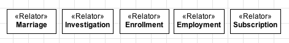
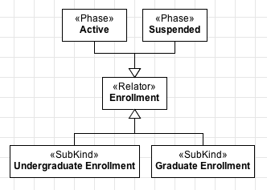

Definition
----------

The «:ref:`relator`» construct is used to represent **truth-makers** of :ref:`material relations <material>`, i.e., the "things" that must exist in order for two or more individuals to be connected by :ref:`material relations <material>`. Because of this nature, relators are always :ref:`dependent <dependency>` on other individuals to exist. Here are some examples of concepts classified as relators:

.. container:: figure

   |Relator examples|

Note that the «:ref:`relator`» meta-class is analogous to the «:ref:`kind`», «:ref:`collective`» and «:ref:`quantity`» meta-classes, in the sense that it is :ref:`rigid <rigidity>` and provides an :ref:`identity principle <identity>` for its instances. The difference is that, instead of representing functional complexes, quantities or collections, a «:ref:`relator`» represents the objectification of relational properties. The direct consequence is that relators can also be specialised by :ref:`subkinds <subkind>`, :ref:`phases <phase>` and :ref:`roles <role>`, and generalised by :ref:`categories <category>` and :ref:`mixins <mixin>`.

.. container:: figure

   |Relator application 1|

