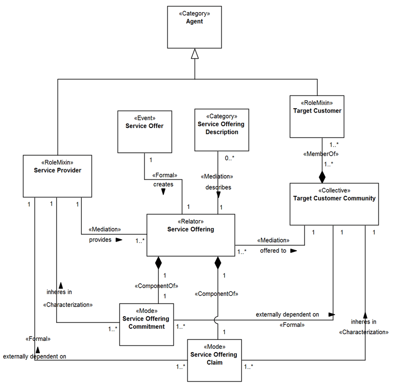

Examples
--------

.. _relator-examples-ex1:
**EX1:** Conceptual model about the Catholic Clergy (`see more <http://web.archive.org/web/20171008151858/http://www.menthor.net/clergy.html>`__):

.. container:: figure

   |Example Catholic Clergy|

.. _relator-examples-ex2:
**EX2:** Fragment of a conceptual model representing the worldview of a possible parking lot management system (`see more <http://web.archive.org/web/20171008152130/http://www.menthor.net/parking-lot.html>`__):

.. container:: figure

   |Example Parking Lot|

.. _relator-examples-ex3:
**EX3:** UFO-S fragment focused on service offering (`see more <http://web.archive.org/web/20171007071851/http://www.menthor.net/ufo-s.html>`__):

.. container:: figure

   |Example UFO-S|

.. _relator-examples-ex4:
**EX4:** Fragment of a conceptual model about the human genome (`see more <http://web.archive.org/web/20171008151924/http://www.menthor.net/cshg.html>`__):

.. container:: figure

   |Example Human Genome|

.. |Example Catholic Clergy| image:: _images/583962_orig.png

