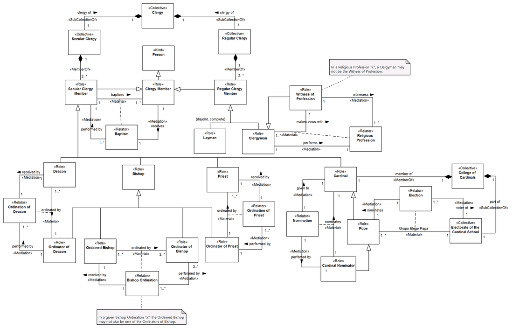
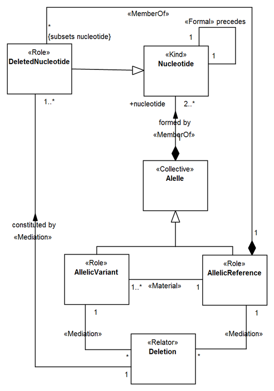
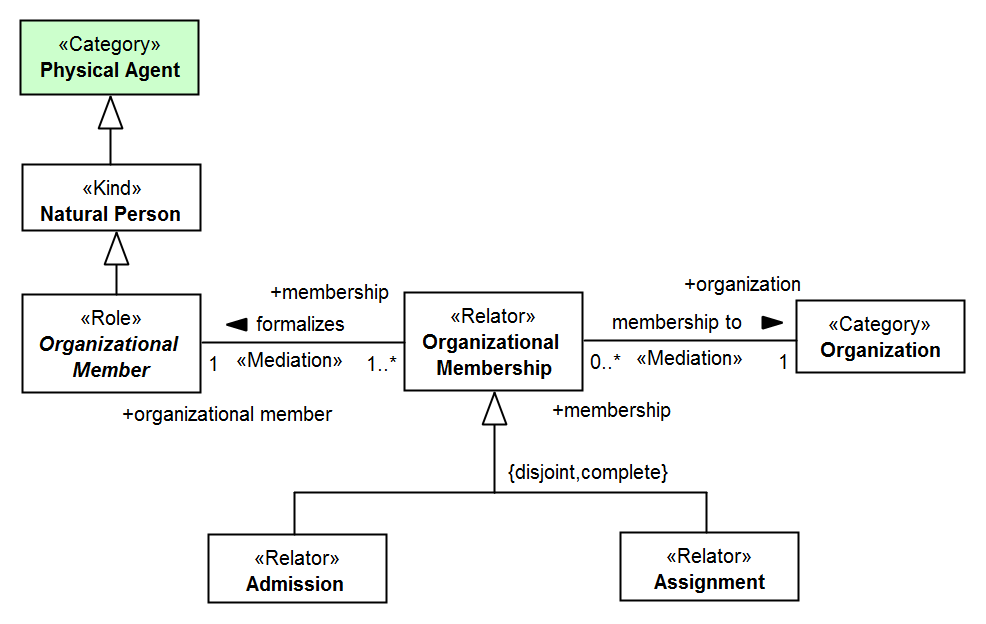

Examples
--------

.. _role-examples-ex1:
**EX1:** Conceptual model about roles in the Catholic clergy (`see
more <http://web.archive.org/web/20171008151858/http://www.menthor.net/clergy.html>`__):

.. container:: figure

   |Example Catholic Clergy|

.. _role-examples-ex2:
**EX2:** Fragment from an ontological analysis of a Human Genome scheme
(`see more <http://web.archive.org/web/20171007171607/http://www.menthor.net/normative-acts.html>`__):

.. container:: figure

   |Example Human Genome|

.. container::

   **Errata:** No material derivation, bad material multiplicity, bad
   memberOf multiplicity

.. _role-examples-ex3:
**EX3:** Fragment of the OntoUML Org Ontology (O3) (`see
more <http://web.archive.org/web/20171008152055/http://www.menthor.net/o3.html>`__):

.. container:: figure

   |Example O3|

.. container::

   **Errata**: Relator cannot be subtype of Relator, Category not
   abstract and no subtypes (or just one), no material relation

