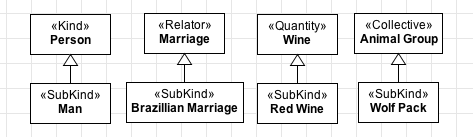
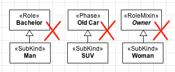
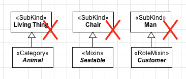

Constraints
-----------

.. _subkind-constraints-c1:
**C1:** A «:ref:`subkind`» must **always** have exactly one :ref:`identity provider <identity>`
(«:ref:`kind`», «:ref:`collective`», «:ref:`quantity`», «:ref:`relator`», «:ref:`mode`», «:ref:`quantity`») as an ancestor (a direct or indirect super-type). Therefore, our examples in
the first figure should be modelled as:

.. container:: figure

   |Subkind application 1|

.. _subkind-constraints-c2:
**C2:** Because it is a :ref:`rigid <rigidity>` type, a «:ref:`subkind`» cannot have an
:ref:`anti-rigid <rigidity>` type («:ref:`role`», «:ref:`phase`», «:ref:`rolemixin`») as an ancestor.
Therefore, the following fragments would not be allowed:

.. container:: figure

   |Subkind forbidden 1|

.. _subkind-constraints-c3:
**C3:** Since every instance of a «:ref:`subkind`» follows the same :ref:`identity
principle <identity>`, a «:ref:`subkind`» cannot have an mixin type («:ref:`category`», «:ref:`mixin`», «:ref:`rolemixin`») as a descendant, i.e., a direct or indirect subtype.
Fragments like the ones below are not allowed:

.. container:: figure

   |Subkind forbidden 2|

