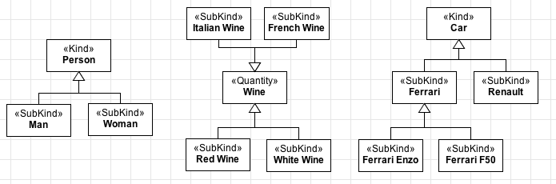
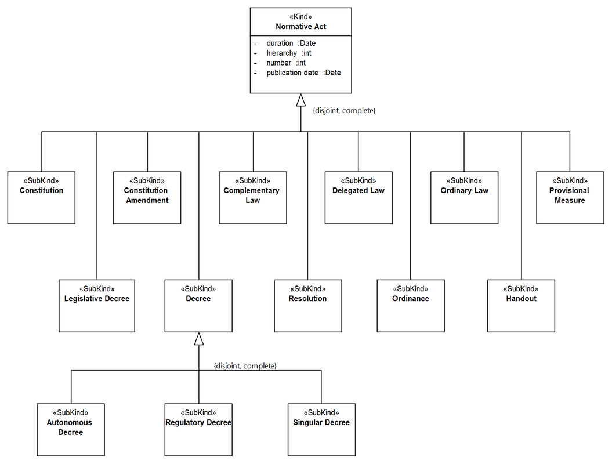
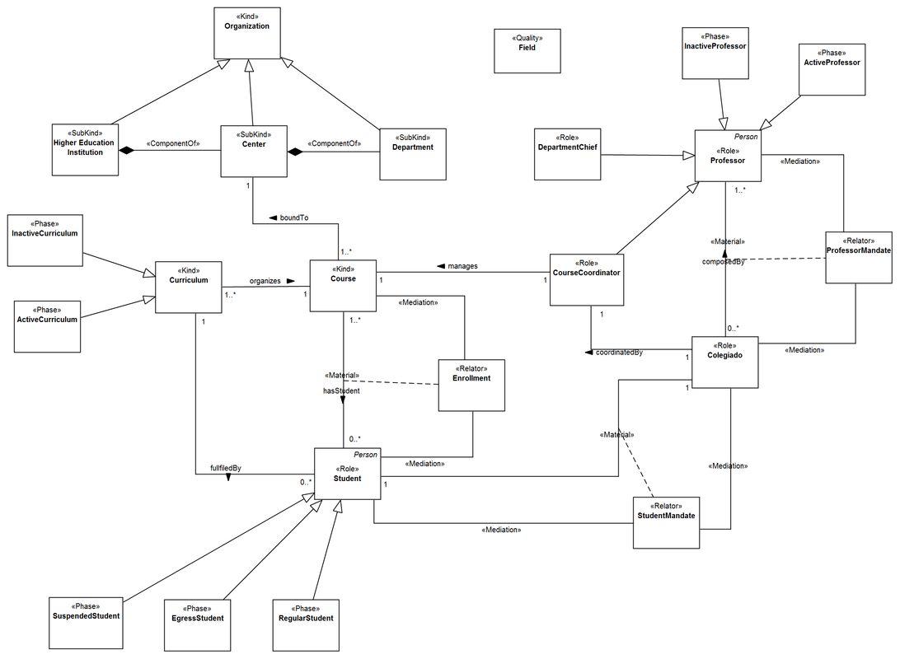

Examples
--------

.. _subkind-examples-ex1:
**EX1:** Usually, subkinds come in groups, like in the examples below:

.. container:: figure

   |Subkind application 2|

.. _subkind-examples-ex2:
**EX2:** Fragment from the Normative Acts Ontology (`see
more <http://web.archive.org/web/20171007171607/http://www.menthor.net/normative-acts.html>`__):

.. container:: figure

   |Example NAO|

.. _subkind-examples-ex3:
**EX3:** Fragment of a conceptual model about Brazilian Universities
(`see more <http://web.archive.org/web/20171007171848/http://www.menthor.net/university.html>`__):

.. container:: figure

   |Example University|

