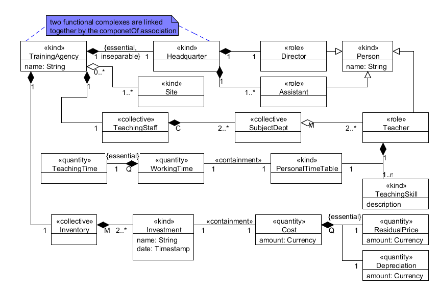
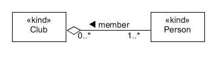
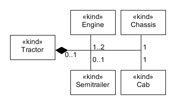
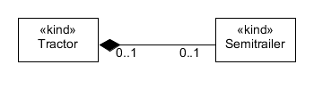
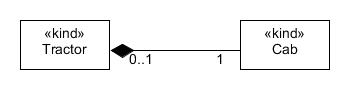
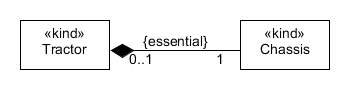
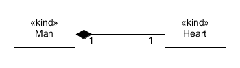
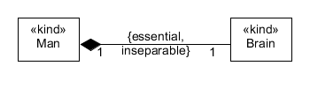
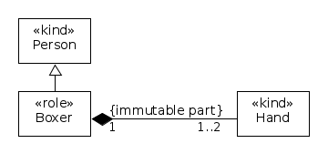
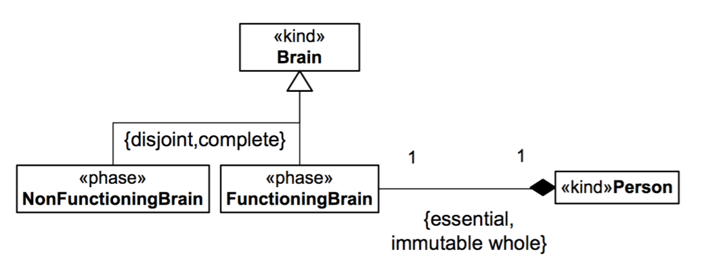

.. _part-whole:

Part-Whole
==========

UML distinguishes between aggregation and composition only. OntoUML distinguishes among

-  sharing

   -  shared part (white ◊)
   -  exclusive part (black ♦)

-  multiplicity of relationship

   -  mandatory part with respect to the whole
   -  mandatory whole w.r.t. the part
   -  mandatory non-rigid type (e.g. role, phase, mixin)

OntoUML also distinguishes among various types of wholes and their parts

-  **functional whole** (and :ref:`componentOf` relation)
-  :ref:`collective` (and :ref:`subCollectionOf` and :ref:`memberOf` relations)
-  :ref:`quantity` (and :ref:`containment` and :ref:`subQuantityOf` relations)

.. _part-whole-examples:

Examples
--------

**EX1:** |Part-Whole Relations|

**EX2:** |Example of shared part|

Notice that maximum multiplicity of the whole is > 1.

**EX3:** |Exclusive Part|

Notice that maximum multiplicity of the whole is = 1.

**EX4:** |Optional Part|

Optional part w.r.t. the rigid whole. The whole doesn´t necessarily need any part.

**EX5:** |Mandatory Part|

Mandatory part w.r.t. the rigid whole. The whole does need a part, instances of the part may mute.

**EX6:** |Essential Part|

Essential part w.r.t. the rigid whole. The whole does need a part, instances mustn´t mute.

**EX7:** |Optional Whole|

Optional rigid whole w.r.t. the part. The part may exist alone, even without the whole.

**EX8:** |Mandatory Whole|

Mandatory rigid whole w.r.t. the part. The part must belong to some whole, instances of the whole may mute.

**EX9:** |Inseparable Part|

Inseparable part of the rigid whole. The part must belong to the same whole, instances of the whole mustn´t mute.

**EX10:** |Immutable Part|

Immutable part of the antirigid whole. Whenever the whole exists in the particular role or phase, its parts must be still the same instances -- they cannot not mute. Compare to *{essential}*.

**EX11:** |Immutable Whole|

Immutable whole w.r.t. the antirigid part. Whenever the part exists in the particular role or phase, its wholes must be still the same instances -- they cannot not mute. Instances of the whole may mute only as the part changes it´s role or phase.  

.. container:: figure

   **References:**

GUIZZARDI, Giancarlo. *Ontological Foundations for Structural Conceptual Models.* Enschede: CTIT, Telematica Instituut, 2005. GUIZZARDI, Giancarlo. *Introduction to Ontological Engineering.* [presentation] Prague: Prague University of Economics, 2011.

